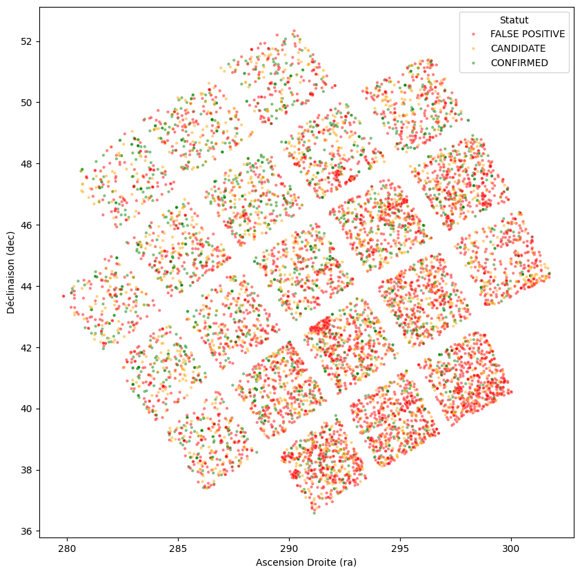
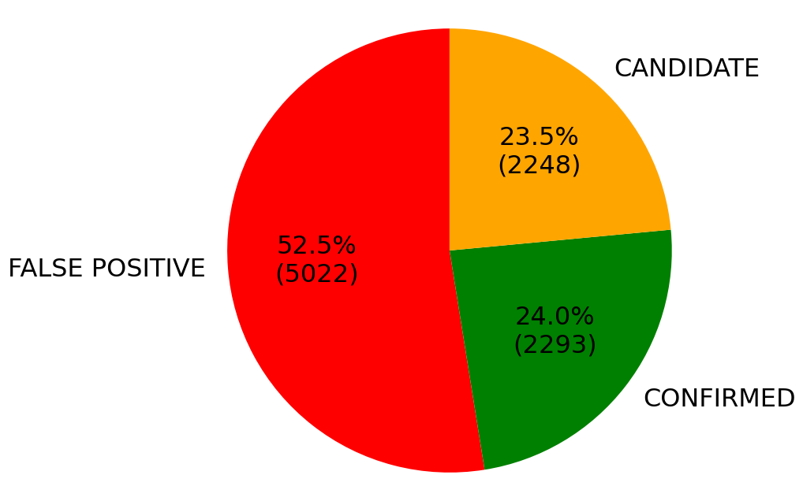
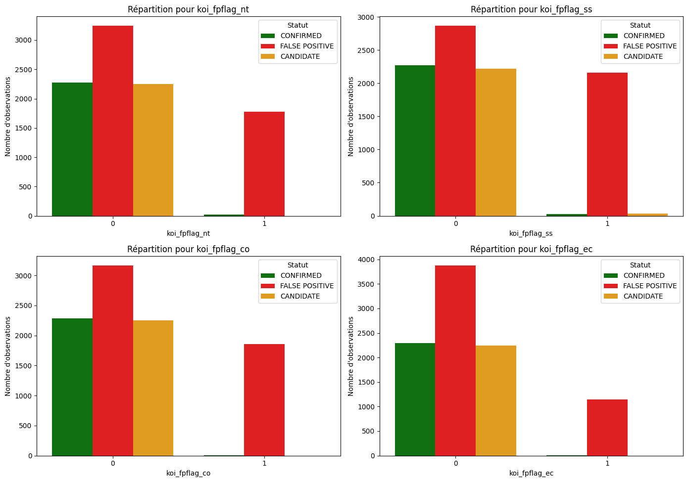

<div align="center">

# Kepler Exoplanet Candidates

Statistical and multivariate analysis of NASA's Kepler Objects of Interest catalogue:<br>
what separates a confirmed exoplanet from a false positive?



&nbsp;


</div>

<br>

| | |
|---|---|
| Context | Six-person student project, November-December 2025 (notebooks and report in French) |
| Data | 9,564 transit signals from the Kepler space telescope, 50 variables |
| Methods | Hypothesis tests, PCA, correspondence analysis, canonical correlation analysis, five clustering algorithms |
| Key findings | Planet size is the strongest physical discriminant; 93 % of giant objects are false positives |

---

## Contents

- [Context](#context)
- [Data](#data)
- [Analysis](#analysis)
- [Key results](#key-results)
- [Getting started](#getting-started)
- [Repository structure](#repository-structure)
- [Limitations](#limitations)

---

## Context

The Kepler space telescope (2009-2018) monitored about 150,000 stars and detected planets with the transit method: a periodic dip in a star's brightness when a planet passes in front of it. Each signal becomes a Kepler Object of Interest (KOI) labelled `CONFIRMED`, `CANDIDATE` or `FALSE POSITIVE`. Many signals are not planets at all (eclipsing binary stars, background contamination, instrumental noise), so telling real planets from look-alikes is the central problem of the catalogue.

## Data

| | Raw table | Cleaned table |
|---|---|---|
| Objects | 9,564 | 7,994 |
| Variables | 50 | 25 |
| False positives | 5,023 (52.5 %) | 3,921 (49.0 %) |

The variables cover the orbit (period, transit duration and depth, impact parameter), the planet (radius, equilibrium temperature, insolation), the host star (temperature, surface gravity, radius, magnitude) and the Kepler pipeline (score and four false-positive flags). The cleaned table is produced by notebook 01: identifiers, empty error columns and near-empty columns are removed, then rows with missing values are dropped.

Source and column definitions: [`data/DATASET.md`](data/DATASET.md).

## Analysis

| Notebook | Content |
|---|---|
| [`01_exploratory_and_multivariate_analysis`](notebooks/01_exploratory_and_multivariate_analysis.ipynb) | Distributions by class, sky map, descriptive statistics, Shapiro-Wilk and D'Agostino normality tests, Spearman correlations, Kruskal-Wallis and χ² tests, missing-value analysis, outliers, encoding, PCA with k-means, correspondence analysis (SVD of the standardised residuals) |
| [`02_canonical_correlation_analysis`](notebooks/02_canonical_correlation_analysis.ipynb) | Links between planet and host-star variables, Bartlett χ² test on the number of significant canonical dimensions |
| [`03_unsupervised_clustering`](notebooks/03_unsupervised_clustering.ipynb) | DBSCAN, HDBSCAN, k-means, Ward hierarchical clustering and spectral clustering, then cluster profiling (violin plots, period-radius plane, t-SNE) |

## Key results

### False-positive flags are almost perfectly informative

When one of the four Kepler pipeline flags is raised, the object is very rarely a confirmed planet, and χ² tests confirm a very strong association between each flag and the final disposition.

<p align="center"></p>

### Planet size is the strongest physical discriminant

The correspondence analysis between size class and disposition has a total inertia of 0.364, and its first axis carries 92.4 % of it.

| Size class | Confirmed | Candidate | False positive |
|---|---:|---:|---:|
| Earth (< 1.25 R⊕) | 18.9 % | 33.9 % | 47.2 % |
| Super-Earth (1.25-2 R⊕) | 42.6 % | 30.1 % | 27.4 % |
| Neptune (2-6 R⊕) | 53.1 % | 24.3 % | 22.6 % |
| Jupiter (6-15 R⊕) | 29.7 % | 23.2 % | 47.1 % |
| Giant (> 15 R⊕) | 0.7 % | 6.1 % | 93.1 % |

Giant objects are almost always eclipsing binaries mimicking a planet, while super-Earths and Neptune-sized objects make up most confirmed planets.

### Planet and star variables are strongly linked, once a leakage is removed

A first canonical correlation analysis gave a suspicious correlation of 0.978: the planet's equilibrium temperature is computed from stellar quantities. Once that variable is removed, the canonical correlations are 0.759, 0.236 and 0.166, all three significant at the 1 % level (Bartlett test). The first dimension ties planet radius, stellar radius and transit depth together, which is the geometry of a transit.

### The catalogue has weak cluster structure

Clustering on 19 log-transformed, standardised variables:

| Algorithm | Clusters | Silhouette | Outcome |
|---|---|---:|---|
| DBSCAN | 1 + noise | n/a | Fails: 99.4 % of points in one cluster |
| HDBSCAN | 3 + noise | 0.362 | Rejected: 3,519 objects (44 %) labelled as noise |
| k-means | 5 | 0.224 | Spherical clusters do not fit the data |
| Ward hierarchical | 5 | 0.217 | Used to choose k = 5 |
| Spectral clustering | 5 | 0.294 | Retained: best score while assigning every object |

Silhouette scores of 0.2 to 0.3 mean overlapping groups: the catalogue forms continuous populations rather than well-separated clusters, which is consistent with the physics.

## Getting started

```bash
git clone https://github.com/bilal-jaiel/kepler-exoplanet-analysis.git
cd kepler-exoplanet-analysis
pip install -r requirements.txt
jupyter notebook notebooks/
```

Run the notebooks in order. Notebook 01 regenerates `data/cumulative_cleaned.csv` (identical to the committed file), which notebooks 02 and 03 read. The correspondence-analysis cells also write figures and tables to `output/afc_results/`, which git ignores. All three notebooks run end to end with current pandas and scikit-learn (HDBSCAN needs scikit-learn 1.3 or later).

## Repository structure

```
├── data/
│   ├── DATASET.md                        source, files, column definitions
│   ├── cumulative.csv                    raw KOI table
│   └── cumulative_cleaned.csv            cleaned table (output of notebook 01)
├── notebooks/
│   ├── 01_exploratory_and_multivariate_analysis.ipynb
│   ├── 02_canonical_correlation_analysis.ipynb
│   └── 03_unsupervised_clustering.ipynb
├── docs/
│   ├── statistical_analysis_report.pdf   written report (French)
│   ├── kepler_variables_glossary.pdf     physics of the variables (French)
│   └── figures/
└── requirements.txt
```

## Limitations

- The project is descriptive and unsupervised: no classifier is trained to predict the disposition. Since the flags and `koi_score` are so informative, a supervised model would have to exclude them so as not to relearn the pipeline's own decision.
- Rows with missing values are dropped (16 % of the catalogue), which may bias the cleaned sample.
- Clustering results depend on the log transform and on hand-tuned hyper-parameters (ε, minimum cluster size, number of neighbours).
- Notebook 01 gathers sections written by different team members, so some loading and transformation steps are repeated.

---

<div align="center">
<sub>Akram Halimi · Bilâl Jaiel · Kalaivaasan Balakumar · Haron Mataoui · Lucas Ribeiro · Houdaïfa Hsaïni<br>
<a href="https://github.com/bilal-jaiel">GitHub</a> · <a href="https://www.linkedin.com/in/bilal-jaiel/">LinkedIn</a></sub>
</div>
